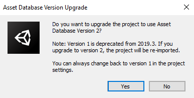
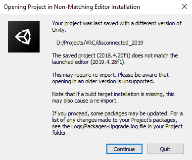
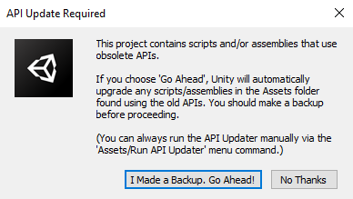
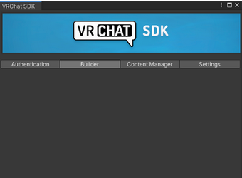

# 從 2018 LTS 遷移至 2019 LTS

如果你正要開始一個新專案，你只需按照以下說明安裝 Unity Hub 和 Unity 2019.4.x，然後查看[選擇你的 SDK](https://docs.vrchat.com/docs/choosing-your-sdk) 來獲取 SDK。

有關 VRChat 升級到 Unity 2019 的更多資訊，請[閱讀我們的博客文章](https://medium.com/vrchat/vrchat-engine-upgrade-unity-2019-lts-57b0b2e149d7)！

## 安裝 Unity Hub 

Unity Hub 是一個單獨的程式來允許你一次安裝和使用多個 Unity 版本。如果你還沒有使用過它，你真的應該要試試看。

1. **取得 Unity Hub** - 在 [**下載 Unity**](https://unity3d.com/get-unity/download) 頁面下載 Unity Hub。點擊綠色的「Download Unity Hub」來只下載 Unity Hub 。
2. **安裝Unity Hub** - 執行下載的安裝檔。安裝完成後，你就已經準備好來安裝 Unity 2019.4.x了！

## 安裝Unity 2019.4.x LTS 

現在你已經安裝了 Unity Hub，你可以來安裝正確版本的 Unity 2019了！

要安裝 Unity ，請轉到[目前支援的 Unity 版本](../current-unity-version.md)頁面。 在那裡，你將了目前VRChat支援的 Unity 版本。按照說明通過 Unity Hub 安裝。

如果你找不到正確的版本，請參閱目前支援的 Unity 版本的[直接下載](../current-unity-version.md#direct-downloads)部分以獲取說明。請記住，你必須手動將安裝位置添加到 Unity Hub。

## 準備遷移專案 

在你使用全新安裝的 Unity 2019 開始遷移專案之前，你需要使用先前版本的 Unity 準備你的專案。

### 步驟一：複製一份你的專案 

從 Unity 2018 遷移舊專案時，第一步是複製整個專案資料夾並將它重新命名。添加「-2019」之類的後綴會讓他更容易辨識。

_請不要將舊專案導出為 UnityPackage，這可能會花費很長的時間並出現其他錯誤。_

**在遷移之前保留專案的備份很重要！**將專案匯入到較新版本的 Unity 會使它很難/不可能移植回較舊版本。我們無法幫助你恢復你的專案。

製作完專案資料夾的「-2019」版本後，將它添加到 Unity Hub。


### 備份你的專案

**不要跳過創建專案的副本。**請勿在未先備份專案的情況下嘗試升級它。

儘管升級過程相當輕鬆，但仍有可能出現不可恢復的錯誤。 我們無法幫助您恢復以這種方式丟失的專案。


### 步驟二：如果你的專案使用 SDK2 或 SDK3-Avatars，請在升級前匯入 2019 SDK 


這個步驟僅適用於 SDK3-Avatar 和 SDK2。如果你要升級 SDK3-Worlds 的專案（使用 Udon 的世界），請跳到下一個步驟。你將在升級過程完成後匯入新的 SDK。


如果你要升級使用 SDK3-Avatars 或 SDK2的專案，請你在 2018 時匯入新的 2019 SDK。匯入後你可能會在這裡遇到一些錯誤，不過你可以先忽略掉它們。 完成後關閉 Unity。

我們的 SDK 可在選擇你的 SDK 頁面上列出的位置取得。像往常一樣將 .unitypackage 匯入到你的專案裡，覆蓋所有舊檔案。

### 步驟二點五：準備升級 

#### 創建一個空場景 

**如果你的專案有使用 UdonSharp**，請按照以下步驟操作。跳過這個步驟將導致場景中的所有 U# 行為遺失引用並損壞。

為了格外小心，我們將創建一個新的空場景並在開啟該場景的情況下保存我們的專案。這將導致在升級後打開 Unity 時先載入的是這個新的空場景，而不是包含大量工作的場景。

從**檔案**選單中，點擊**新場景**。然後，儲存你的場景/專案。

這樣做是為了防止 Unity 在編譯所有程式集之前嘗試打開場景，這會導致場景中的所有腳本行為遺失引用並損壞。

#### 布料 

**對專案中的每個布料 Mesh 執行以下步驟。**跳過此步驟將導致場景中的所有布料對象遺失數據並損壞。

Hai 社群製作了一個工具可以自動涵蓋以下所有步驟，可以在[這裡](https://github.com/hai-vr/unity-2018-2019-cloth-transfer)下載。**如果您選擇使用它，請仔細閱讀他們的說明！**

如果你的專案（角色或世界）中有使用到 Unity 布料，則升級專案時將丟失。但是，可以通過在升級前採取一些步驟來恢復布料。

你必須為專案中具有布料組件的每個 _Skinned Mesh Renderer_執行以下操作。\

1. 對於每個帶有布料組件的 _Skinned Mesh Renderer_，找到它們的 Mesh 欄位。
2. 開啟專案分頁
3. 點擊Mesh的白色區域，使它在專案資產中突顯。它可能是 FBX 模型內的Mesh。
4. 選擇突顯的Mesh，然後按 Ctrl-+D 複製該Mesh資產。
5. 通過點擊組件右上角的齒輪並選擇複製來複製布料組件。
6. 再次點擊齒輪，然後點移除組件。
7. 將複製的網格拖到 Skinned Mesh Renderer的 Mesh 欄位中。
8. 點擊 Skinned Mesh Renderer 或 Transform 組件右上角的齒輪，然後單擊 Paste As New。 這將重新添加布料組件並將所有組件值歸回原處。

如果你這樣做，升級時布料將不會遺失。

這是因為 Unity 2019 中 FBX 匯入器的變更，詳細記錄在[這裡](https://forum.unity.com/threads/major-cloth-issues-in-v2019-2-0f1.730385/page-3#post-7174396)。

### 步驟三：將專案升級到2019 

好了！我們現在都準備好了。現在你已經安裝了 Unity Hub、正確的 Unity 2019 版本、升級到 2019 SDK，並準備好你的專案，你可以開始遷移了！

所有三個 SDK（SDK2、SDK3-Avatars 和 SDK3-Worlds）的遷移過程非常相似。只有 SDK3-Worlds 不同。 請仔細按照以下步驟操作。

嘿，你。對，就是你，那個認為跳過[準備專案](migrating-from-2018-lts-to-2019-lts.md#prepare-your-project-for-migration)會加快升級速度的你。回去照著這些步驟操作，否則你接下來所要做的就是不可挽回地弄亂你的專案，我們無法幫助你恢復它。對不起，我太咄咄逼人了，但我們不希望你失去你所有的努力。慢慢來，按照步驟操作。


### 遷移時請不要嘗試變更 SDK 種類

遷移專案時，請使用你在之前的 Unity 版本中使用的相同 SDK 種類。


1. **將你的專案新增到 Unity Hub 裡。**在 Unity Hub 中，點擊主界面的「舊專案」按鈕，然後找到你準備好的專案副本所在的目錄。
2. **在 Unity Hub 中將你的專案設定為新的 Unity 版本。**確保在 Unity Hub 中選擇當前版本作為專案的 Unity 版本。
3. **打開你的專案。**在 Unity Hub 中點擊你的專案以將它打開。

4a. 系統會提示你是否要將專案升級到較新版本的 Unity。選擇「確認」。

.png>)

&#x20; 4b. 系統會提示你是否要升級專案以使用資產數據庫版本 2 - \*\*選擇「Yes」。

&#x20; 4c. 你_可能_會收到警告提示你在非匹配編輯器安裝中打開專案。選擇「Continue」。

&#x20; 4d. 你_可能_會收到警告提示你需要 API 更新。選擇「I made a backup, go ahead」。

&#x20; 4e. **匯入可能需要一段時間！**Unity 將重新匯入資源並為 Unity 2019 更新你的專案。請耐心等候！對於大型專案，這個過程可能會花上30 分鐘以上，如果您你用的是機械硬碟，則可能需要更長的時間。一旦你的專案打開，你就可以繼續了。

順帶一題，這是合理分開你的專案而不是將你的 VRChat 工作蓋成一兩個大型專案的一個很好的理由。

&#x20; 5\. **打開你的場景。** Unity 備份後，你應該能夠打開場景並訪問您的內容。

&#x20; 6\. 如果你升級的是世界專案，**請現在匯入 2019 SDK3-Worlds。**你在準備階段跳過了重新匯入新 SDK。_現在將2019SDK匯入並覆蓋掉舊的SDK。_

### 問題排除

#### 清除Library資料夾

我們已經知道 SDK2 的一些錯誤，其中Library資料夾無法正確地重建。要解決這個問題很簡單，因為 Library 資料夾只是用來暫存臨時檔案。

**要刪除 Library 資料夾**，你只需到你的專案資料夾裡刪除名為 Library 的資料夾。它不會在 Asset 裡，而是在專案資料夾的根目錄下（Assets 的旁邊）。

此外，在遷移到 2019 之前刪除Library資料夾不是一個好主意，所以不要這樣做。除非你已經完成上述的第 5 步並且仍然遇到問題，不然請先不要刪除它。

SDK2 刪除 Library 可能對 SDK3 也有幫助，但除非需要，否則請不要這樣做。SDK3 可以更好地處理遷移，而不需要這個步驟。

#### 我在控制台中看到一大堆的錯誤

莫急莫慌莫害怕！通常你看到的第一個錯誤是重要的。多點清除幾次，看看第一個（最上面的）是什麼。它可能不是 VRChat SDK 組件所引起的 —— 通常，這些錯誤都是由第三方組件和腳本所引起的。

刪除這些組件和腳本並/或從他們的原始來源來更新它們。請記住，作者們可能需要一些時間來更新他們的工具。

不要恐慌！ 您看到的第一個錯誤通常是重要的錯誤。 單擊清除幾次，看看第一個（最上面的）是什麼。 它可能沒有指向 VRChat SDK 組件——通常，這些錯誤是由第三方組件和腳本引起的。

如果你的 2018 Unity 專案使用的是較舊的 SDK，它可能無法乾淨地遷移過來，這是將另一個導致錯誤的原因。下載並更新到最新的公開 2018 SDK，並在 Unity 2018 中打開專案，然後按照遷移步驟查看是否能修復它。

## 我需要遷移並重新上傳我的內容嗎？

那取決於你的內容。在這個特定的升級中，實際上不需要重新上傳的東西並不多！ 以下是你在評估是否應該遷移並重新上傳你的世界或角色時應考慮的列表：

### Shader

為了讓 VRChat 對 Unity 2019 的更新對每個人來說都變得容易，我們花了許多心思！Unity 2018 的內容應該能像更新前一樣正常顯示。不過考慮到Shader的多樣性令人難以置信，我們不能保證一切都會像以前一樣運作。如果你有遇到Shader的問題，我們的建議始終還是遷移並重新上傳。

### 地形

Unity 2019 再次對地形的運作方式進行了一些修改，特別是在Shader和頂點著色方面。 如果你將 Unity 地形與內建 Shader 一起使用，那應該就沒問題。如果你對 Unity 地形、他們的 Shader 或使用基於頂點的著色做任何特別的事情，你可能會需要重新上傳。

### 其他問題

如果你在 2019 測試你的內容並發現了問題，請在將它回報錯誤之前嘗試重新上傳。有很多事情我們可能無法從重新上傳的舊內容中修復。

### 空白控制面板或缺少 VRCUrlInputField

如果你的控制面板就像上圖那樣的空白，請嘗試以下手段：

* 在專案視窗中，到 Assets/VRCSDK/Plugins
* 選擇所有DLL檔，點擊右鍵>重新匯入

如果你的影片播放器缺少了 VRCUrlInputField，這應該也可以解決這個問題。

### 如果我重新上傳，它會覆蓋掉我目前的內容嗎？

沒有！我們保留每個版本的 Assets。你可以上傳到相同的 ID，而你的 2018 版本將保持不變。如果你使用的是 2019 版 VRChat，你將取得 2019 年的內容（如果有的話）。不會有什麼改變。
