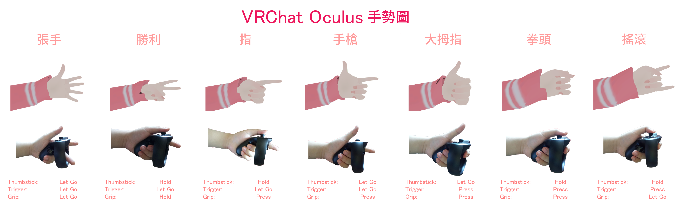

# Oculus Touch

## 手勢圖 

| 手勢名稱 | 手勢敘述                                |
| ---- | ----------------------------------- |
| 拳頭   | 
中指向下

食指按下板機

拇指向下
 |
| 張手   | 
中指向上

食指離開板機

拇指向上
 |
| 指    | 
中指向下

食指離開板機

拇指向下
 |
| 大拇指  | 
中指向下

食指扣板機

拇指向上
  |
| 勝利   | 
中指向上

食指離開板機

拇指向下
 |
| 手槍   | 
中指向下

食指離開板機

拇指向上
 |
| 搖滾   | 
中指向上

食指按下板機

拇指向下
 |

使用手勢將會啟用角色上的手勢覆蓋（如果有的話）。

## 按鍵分配 

| 按鍵                                 | 動作                                                           |
| ---------------------------------- | ------------------------------------------------------------ |
| A（右手，底部按鍵）                         | 跳躍                                                           |
| X （左手，底部按鍵）                        | 靜音                                                           |
| 
B（右手，頂部按鍵）

Y（左手，頂部按鍵）
 | 快速選單                                                         |
| 握（中指按下）                            | 撿                                                            |
| 板機（食指按下）                           | 選擇/互動                                                        |
| 右搖桿                                | 轉向                                                           |
| 左搖桿                                | 移動                                                           |
| 右搖桿按下                              | 右手[動作選單](https://docs.vrchat.com/v2021.3.2/docs/action-menu) |
| 左搖桿按下                              | 左手[動作選單](https://docs.vrchat.com/v2021.3.2/docs/action-menu) |
| 雙板機+雙選單按鍵                          | 
開啟安全模式

切換到自訂義安全等級並將所有角色功能關閉
                     |
